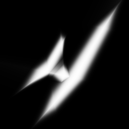
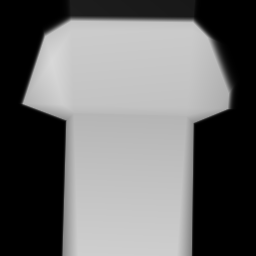
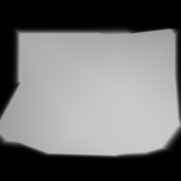

# ZeroZen: MNIST Upscaler
A neural network that doesn’t just see images — it remembers them.  it learns the essence of handwritten digits from mere coordinates.

## What Is This Sorcery? 🧙‍♂️
This isn’t your usual convolutional wizardry. Instead of filters and feature maps, we’re training a fully-connected neural network to memorize an MNIST digit — by mapping normalized (x, y) coordinates to pixel intensities.

Yes, the network becomes the image.
> It’s like asking: “What would a neural network dream of if it only knew where on the canvas it was?”

## How Does It Work? 🛠️
For each grayscale MNIST image:
1. Normalize the (x, y) pixel coordinates to [-1.0, 1.0].
1. Use them as input to the neural network.
1. Train the network to output the corresponding grayscale pixel value.
1. Once trained, sample more densely to reconstruct a higher resolution version of the image.

## Features ✨
1. No image processing libraries — the network is the renderer
1. Learns pixel intensities from coordinates alone
1. Upscales MNIST digits to arbitrary resolutions
1. Saves output as .png files for easy viewing

## Sample Results 🎨

 

 
 

 
 

 

 > Yes, the blurry digits meditate into high-res serenity.
